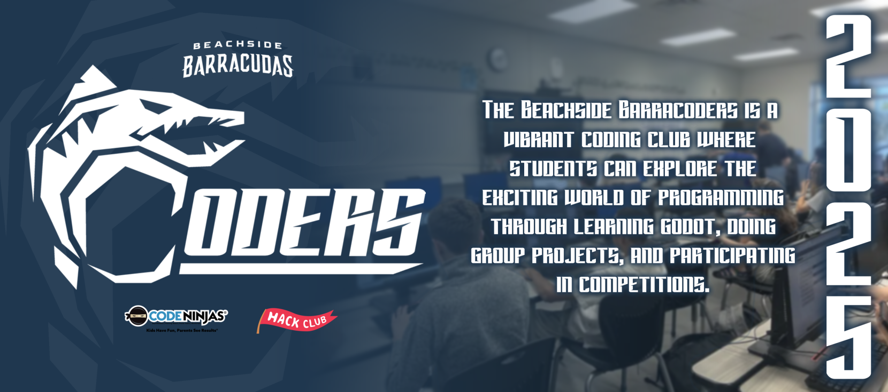

# About Us

The **Beachside Barracoders** is a vibrant school coding club where students come together to explore the exciting world of computer programming. Members of all skill levels collaborate on projects, learn new coding languages, and participate in competitions. With a focus on creativity, teamwork, and innovation, the Beachside Barracoders foster a supportive environment that encourages students to develop their coding skills while having fun.

Students must follow the [Bylaws](https://barracoders.com/docs/bylaws2025-26.pdf) and adhere to the [St. Johns County Acceptable Use Policy](https://barracoders.com/docs/AUP.pdf).
  
# Hack Club Affiliation

The **Beachside Barracoders** are proud members of **Hack Club**, a global network of student-led coding clubs. Hack Club helps students learn to code through hands-on projects and a supportive community. 

We adhere to the [Hack Club Code of Conduct](https://hackclub.com/conduct/) to ensure a respectful and inclusive environment for all members. For more information about Hack Club, visit the [Hack Club website](https://hackclub.com/).

# You Can Find Us Here

- [Our Website](https://barracoders.com)
- [Instagram](https://www.instagram.com/bhs_barracoders/)
- [YouTube](https://www.youtube.com/@bhs_barracoders)

---

We look forward to your participation and can't wait to see what we can build together!
